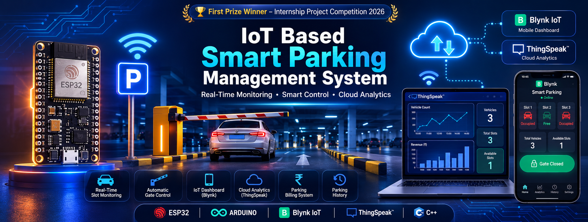
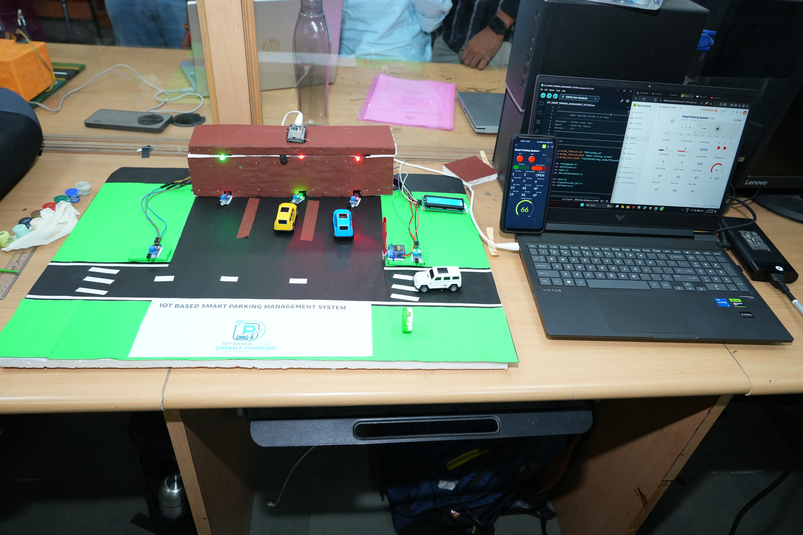
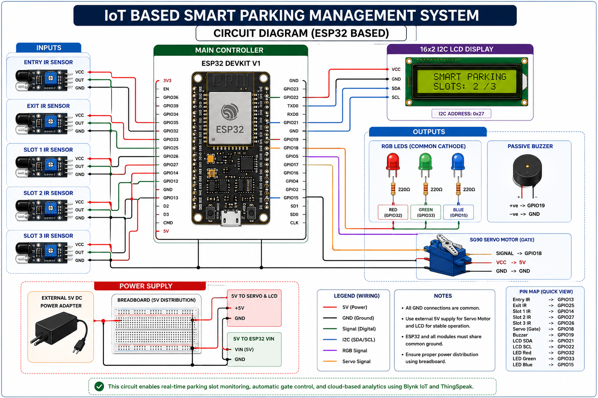
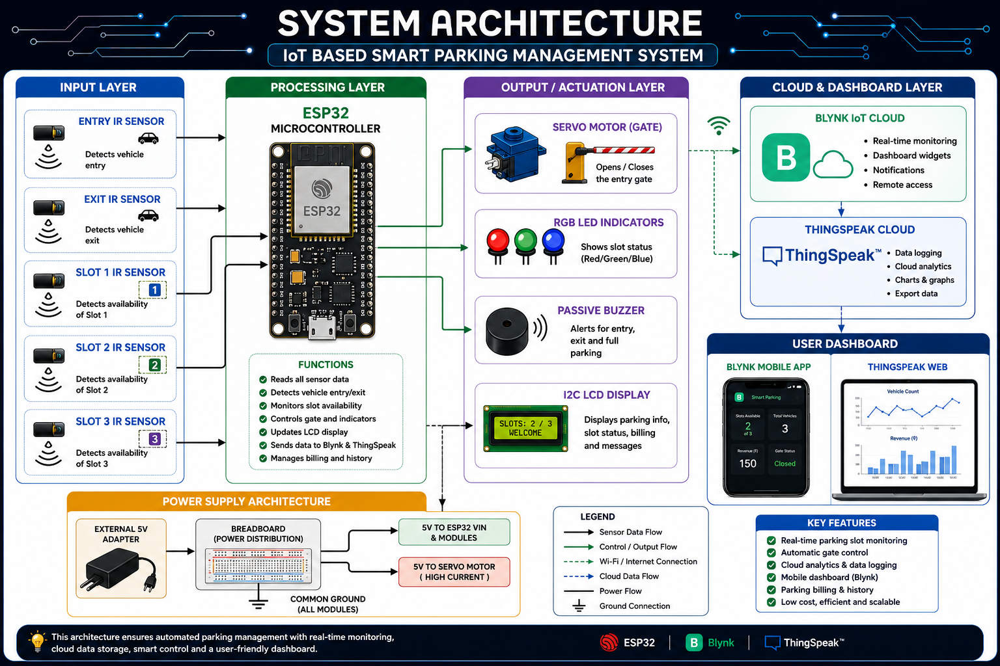
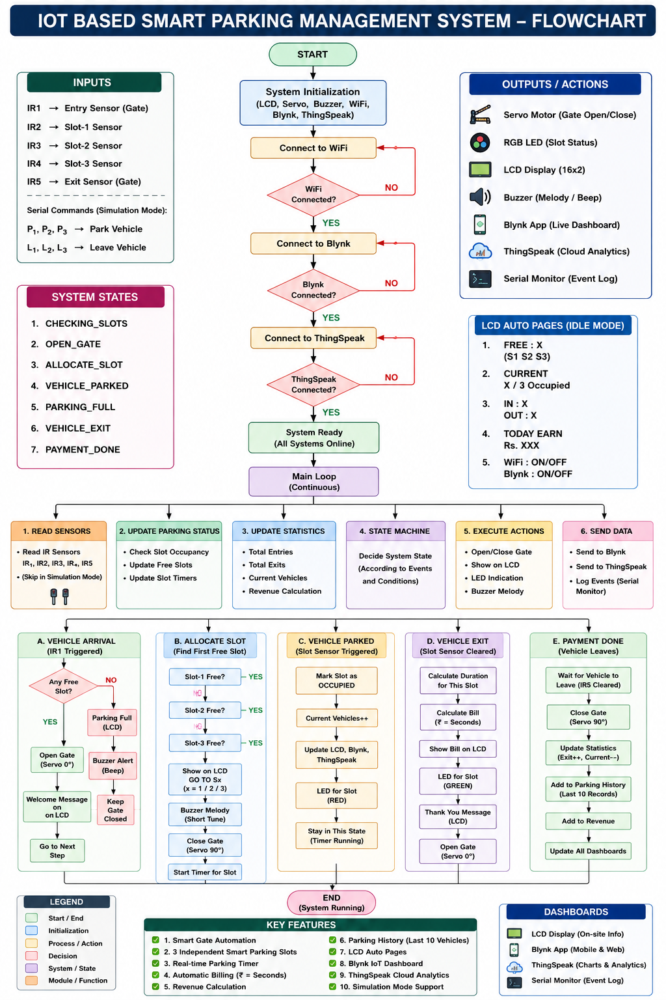
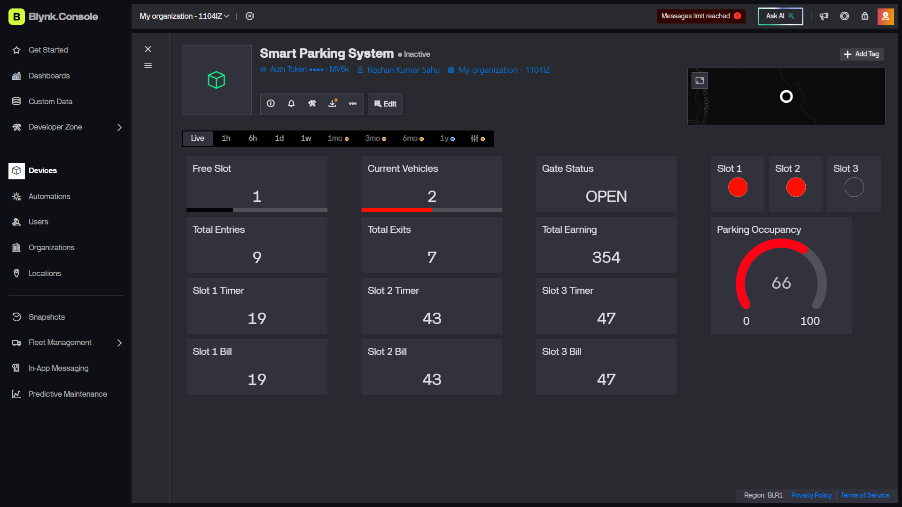
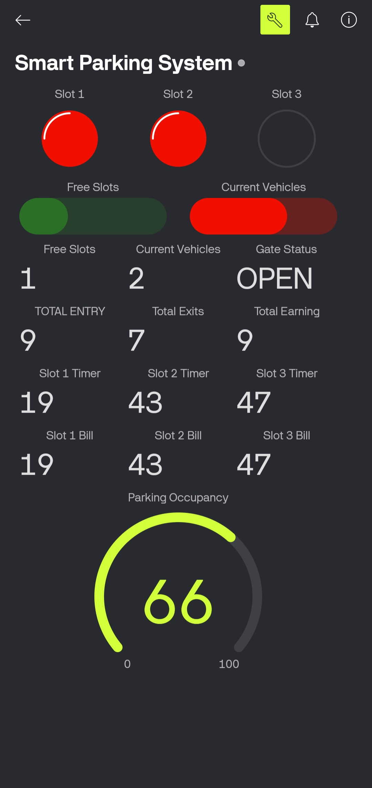
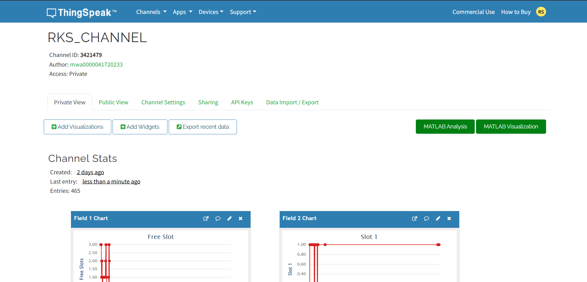
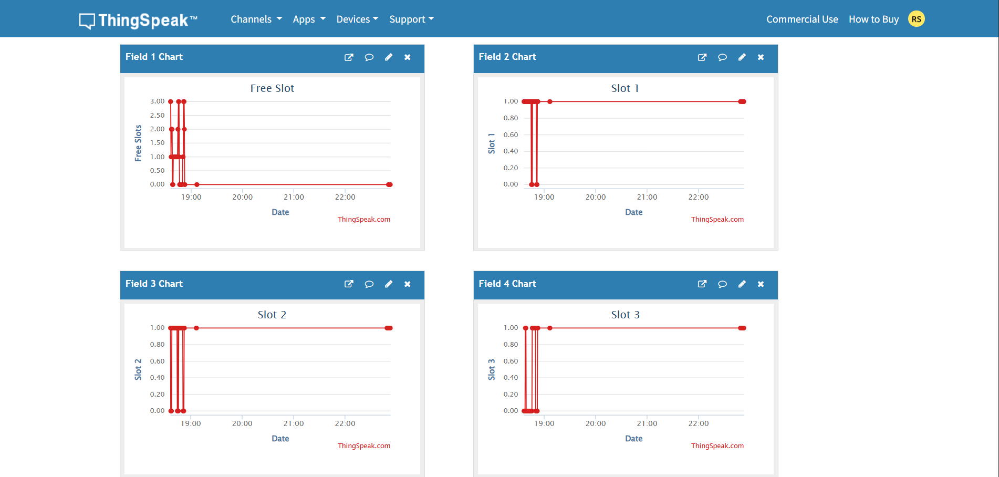
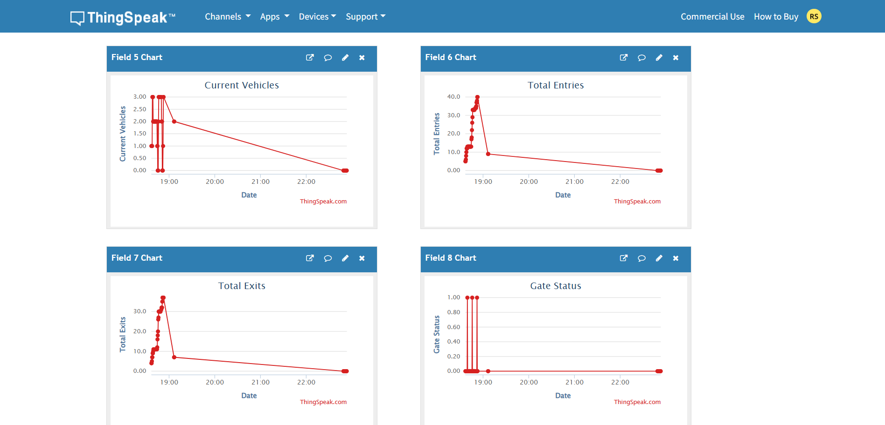

<p align="center">
  
</p>

<h1 align="center">
🚗 IoT Based Smart Parking Management System
</h1>

<p align="center">
An ESP32-powered Smart Parking Management System with automatic gate control,
real-time parking monitoring, cloud analytics, parking billing,
and mobile dashboard integration using <b>Blynk IoT</b> and <b>ThingSpeak</b>.
</p>

<p align="center">


</p>

<h3 align="center">
🏆 First Prize Winner – Internship Project Competition 2026
</h3>

---

# 📚 Table of Contents

- [📌 Project Overview](#-project-overview)
- [📷 Project Prototype](#-project-prototype)
- [⚡ Features](#-features)
- [📋 Project Specifications](#-project-specifications)
- [🛠️ Hardware Components](#️-hardware-components)
- [💰 Approximate Project Cost](#-approximate-project-cost)
- [🔌 ESP32 GPIO Pin Mapping](#-esp32-gpio-pin-mapping)
- [🔧 Circuit Diagram](#-circuit-diagram)
- [🔌 Circuit Connections](#-circuit-connections)
- [💻 Software & Development Environment](#-software--development-environment)
- [📦 Required Arduino Libraries](#-required-arduino-libraries)
- [🏗️ System Architecture](#-system-architecture-diagram)
- [⚙️ Working Principle](#️-working-principle)
- [📊 Blynk Web Dashboard](#-blynk-web-dashboard)
- [📱 Blynk Mobile Dashboard](#-blynk-mobile-dashboard)
- [☁️ ThingSpeak Dashboard](#️-thingspeak-dashboard)
- [🔄 System Flowchart](#-system-flowchart)
- [📂 Project Structure](#-project-structure)
- [🚀 How to Run](#-how-to-run)
- [📈 Future Improvements](#-future-improvements)
- [👨‍💻 Author](#-author)
- [📜 License](#-license)

---

## 📌 Project Overview

Parking management is one of the major challenges in shopping malls, offices, universities, hospitals, and smart cities due to inefficient space utilization and the lack of real-time parking information.

This project presents an **IoT-Based Smart Parking Management System** developed using **ESP32**, which automates vehicle entry and exit, monitors parking slot occupancy in real time, controls the parking gate automatically, and provides cloud-based monitoring through **Blynk IoT** and **ThingSpeak**.

The system also includes an intelligent parking billing mechanism based on parking duration, maintains parking history, displays live information on an I2C LCD, and uses RGB LEDs and a passive buzzer to provide visual and audio indications. The complete system follows a non-blocking state-machine architecture for reliable real-time operation.

### ✨ Key Highlights

- 🚗 Automatic Vehicle Entry & Exit Detection
- 🅿️ Real-Time Parking Slot Monitoring
- 🔐 Automatic Servo Gate Control
- 📟 Live LCD Status Display
- 🌈 RGB LED Slot Indicators
- 🔊 Passive Buzzer Alerts
- ☁️ Cloud Monitoring using Blynk IoT
- 📊 Data Logging & Analytics using ThingSpeak
- 💰 Parking Billing based on Parking Duration
- 📜 Parking History Management
- ⚙️ Non-Blocking ESP32 State Machine
---

# 📷 Project Prototype


> Final hardware prototype developed during the internship project.
> Final Working Prototype during Internship Project Demonstration.
---

# ⚡ Features

- 🚗 Automatic Vehicle Entry & Exit Detection
- 🅿️ Real-Time Parking Slot Monitoring
- 📱 Blynk IoT Dashboard
- ☁️ ThingSpeak Cloud Analytics
- 🔐 Automatic Servo Gate Control
- 📟 16x2 I2C LCD Display
- 🔊 Passive Buzzer Alerts
- 🌈 RGB LED Slot Status Indication
- 💰 Parking Billing System (Demo)
- 📊 Parking History Tracking
- 🔄 Simulation Mode for Testing
- ⚙️ Non-Blocking State Machine Programming

---

# 📋 Project Specifications

| Category | Details |
|----------|---------|
| Project Name | IoT Based Smart Parking Management System |
| Project Type | Embedded Systems & Internet of Things (IoT) |
| Controller | ESP32 DevKit V1 |
| Programming Language | C++ |
| Development Platform | Arduino IDE |
| Communication | Wi-Fi |
| Cloud Platform | Blynk IoT & ThingSpeak |
| Display | 16×2 I2C LCD |
| Sensors | 5 × IR Sensors |
| Actuator | SG90 Servo Motor |
| Alert System | Passive Buzzer & RGB LEDs |
| Power Source | USB + External 5V DC Supply |
| Architecture | Non-Blocking State Machine |

---
# 🛠️ Hardware Components

| Component | Specification | Quantity | Purpose |
|------------|---------------|:--------:|---------|
| ESP32 DevKit V1 | Wi-Fi + Bluetooth Microcontroller | 1 | Main Controller |
| IR Sensors | Obstacle Detection Module | 5 | Entry, Exit & Parking Slot Detection |
| SG90 Servo Motor | 180° Micro Servo | 1 | Automatic Gate Control |
| 16×2 I2C LCD | I2C Interface (0x27) | 1 | Display Parking Information |
| Passive Buzzer | 5V Passive Buzzer | 1 | Audio Alerts & Notifications |
| RGB LEDs | Common Cathode RGB LEDs | 3 | Parking Slot Status Indication |
| Breadboard | Full Size | 2 | Power Distribution & Circuit Connections |
| External Power Supply | 5V DC Adapter | 1 | Servo & LCD Power Supply |
| Jumper Wires | Male-Male / Male-Female | Multiple | Component Interconnections |
| USB Cable | USB Type-A to Type-C | 1 | Programming & ESP32 Power |

---

# 💰 Approximate Project Cost

| Component | Approx. Cost (₹) |
|------------|-----------------:|
| ESP32 DevKit V1 | 500 |
| IR Sensors (5x) | 250 |
| SG90 Servo Motor | 150 |
| I2C LCD Display | 180 |
| Passive Buzzer | 30 |
| RGB LEDs | 30 |
| Breadboards | 180 |
| Jumper Wires | 100 |
| External 5V Adapter | 200 |
| Miscellaneous | 200 |

### **Total Estimated Cost : ₹1,820**
> **Note:** The cost is approximate and may vary depending on component availability and supplier pricing.
---

# 🔌 ESP32 GPIO Pin Mapping

| ESP32 GPIO | Connected Component | Purpose |
|:----------:|---------------------|---------|
| GPIO13 | Entry IR Sensor | Detects vehicle at the entry gate |
| GPIO25 | Exit IR Sensor | Detects vehicle leaving the parking area |
| GPIO14 | Slot 1 IR Sensor | Monitors parking slot 1 occupancy |
| GPIO27 | Slot 2 IR Sensor | Monitors parking slot 2 occupancy |
| GPIO26 | Slot 3 IR Sensor | Monitors parking slot 3 occupancy |
| GPIO18 | SG90 Servo Motor | Controls the automatic parking gate |
| GPIO19 | Passive Buzzer | Generates parking alerts and notifications |
| GPIO21 | I2C LCD (SDA) | I2C Data Line |
| GPIO22 | I2C LCD (SCL) | I2C Clock Line |
| GPIO32 | RGB LED (Red) | Slot status indication |
| GPIO33 | RGB LED (Green) | Slot status indication |
| GPIO15 | RGB LED (Blue) | Slot status indication |
> **Note:**  
> The ESP32 and all peripherals share a **common ground**. The SG90 servo motor and the 16×2 I2C LCD are powered using an **external 5V power supply** to ensure stable operation, while the ESP32 communicates with these peripherals through the GPIO pins listed above.
---
# 🔧 Circuit Diagram



---

# 🔌 Circuit Connections

The Smart Parking Management System is built around the **ESP32 DevKit V1**, which acts as the central controller for all sensors, actuators, and cloud communication.

### Power Distribution

- The **ESP32** is powered through the USB cable during programming and testing.
- An **external 5V DC power supply** is used to power the **SG90 Servo Motor** and the **16×2 I2C LCD Display** to ensure stable operation.
- The external **5V rail** is distributed using a breadboard.
- The **ESP32 VIN pin** is connected to the same **5V power rail**.
- **All components share a common GND (Ground)** to ensure reliable communication and stable circuit operation.

### Peripheral Connections

- **Entry & Exit IR Sensors** detect vehicle movement.
- **Parking Slot IR Sensors** monitor slot occupancy.
- The **SG90 Servo Motor** automatically opens and closes the parking gate.
- The **16×2 I2C LCD** displays parking availability and system status.
- **RGB LEDs** indicate the status of each parking slot.
- The **Passive Buzzer** provides audio alerts for events such as parking full or vehicle entry/exit.

> **Note:** A common ground between the ESP32 and the external 5V power supply is essential for proper operation of the servo motor, LCD, and sensors.
---

# 💻 Software & Development Environment

| Software / Library | Version | Purpose |
|--------------------|:-------:|---------|
| Arduino IDE | 2.x | Code development and ESP32 programming |
| ESP32 Board Package | Latest Stable | ESP32 board support for Arduino IDE |
| C++ | Standard | Firmware development |
| WiFi Library | Built-in | Wi-Fi connectivity |
| Blynk Library | Latest | IoT dashboard communication |
| ThingSpeak Library | Latest | Cloud data logging and analytics |
| ESP32Servo | Latest | Servo motor control |
| LiquidCrystal_I2C | Latest | 16×2 I2C LCD interface |

---

# 📦 Required Arduino Libraries

Before uploading the code to the ESP32, install the following libraries through the Arduino Library Manager:

- ✅ Blynk
- ✅ ThingSpeak
- ✅ ESP32Servo
- ✅ LiquidCrystal_I2C

> **Note:** Ensure that the ESP32 Board Package is installed from the Arduino Boards Manager before compiling the project.

---

# 📊 System Architecture Diagram


> The architecture illustrates how the ESP32 communicates with sensors, actuators, cloud platforms, and the user dashboard.

---

# ⚙️ Working Principle

The Smart Parking Management System operates through the following sequence:

1. **Vehicle Detection**
   - The Entry IR Sensor detects an approaching vehicle and sends a signal to the ESP32.

2. **Parking Availability Check**
   - The ESP32 checks the status of all parking slots using the Slot IR Sensors.

3. **Gate Control**
   - If a parking slot is available, the SG90 Servo Motor automatically opens the entry gate.
   - If all slots are occupied, the gate remains closed and the buzzer alerts the user.

4. **Vehicle Parking**
   - Once the vehicle occupies a parking slot, the corresponding IR sensor updates the slot status.

5. **Real-Time Display**
   - The 16×2 I2C LCD displays:
     - Available parking slots
     - Occupied slots
     - System status

6. **Cloud Data Upload**
   - The ESP32 uploads live parking information to:
     - **Blynk IoT Dashboard**
     - **ThingSpeak Cloud Platform**

7. **Parking Billing**
   - The system records the vehicle's entry and exit time to calculate the parking duration for billing purposes.

8. **Vehicle Exit**
   - When the Exit IR Sensor detects a departing vehicle, the gate opens automatically.
   - The occupied slot is marked as available, and the cloud dashboards are updated instantly.

9. **Continuous Monitoring**
   - The ESP32 continuously repeats this process using a **non-blocking state-machine architecture**, ensuring smooth real-time operation without delays.

---

# 🔄 System Flowchart


> Complete operational workflow of the Smart Parking Management System.
---

# 📊 Blynk Web Dashboard



---

# 📊 Blynk Mobile Dashboard



---

# ☁️ ThingSpeak Dashboard









---

# 📂 Project Structure

```text
IoT-Based-Smart-Parking-Management-System
│
├── 📁 Images
│   ├── PROJECT_BANNER_2.png
│   ├── PROJECT_IMAGE.jpeg
│   ├── CIRCUIT_DIAGRAM.png
│   ├── SYSTEM_ARCHITECTURE.png
│   ├── FINAL_FLOW_CHAT.png
│   ├── BLYNK_IOT_WEB_DASHBOARD.png
│   ├── BLYNK_IOT_MOBILE_DASHBOARD.jpeg
│   ├── THINGSPEAK_PAGE_1.png
│   ├── THINGSPEAK_PAGE_2.png
│   └── THINGSPEAK_PAGE_3.png
│
├── 📁 Source_Code
│   └── Smart_Parking_Management_System.ino
│
├── 📁 Documentation
│   ├── Project_Report.pdf
│   ├── Circuit_Explanation.pdf
│   ├── Presentation.pptx
│   └── Bill_of_Materials.xlsx
│
├── 📁 Flowchart
│   └── System_Flowchart.drawio
│
├── README.md
├── LICENSE
└── .gitignore
```
---

# 🚀 How to Run

1. Install Arduino IDE
2. Install ESP32 Board Package
3. Install Required Libraries:
   - Blynk
   - ThingSpeak
   - ESP32Servo
   - LiquidCrystal_I2C
4. Open the project in Arduino IDE
5. Configure:
   - Wi-Fi SSID & Password
   - Blynk Auth Token
   - ThingSpeak API Key
6. Upload the code to ESP32
7. Power the hardware and monitor the dashboard
8. Power the SG90 Servo Motor and the 16×2 I2C LCD using an external regulated 5V DC supply while maintaining a common ground with the ESP32.

---

# 📈 Future Improvements

- RFID Authentication
- QR Code Based Parking
- Automatic Online Payment
- Mobile Application
- AI-Based Parking Prediction
- Camera-Based Vehicle Detection
- Firebase Database Integration

---

# 👨‍💻 Author

**Roshan Kumar Sahu**

Electronics & Telecommunication Engineering

Parala Maharaja Engineering College (PMEC),Berhampur

---

# 📜 License

This project is licensed under the MIT License.

---

⭐ If you like this project, don't forget to star the repository!
